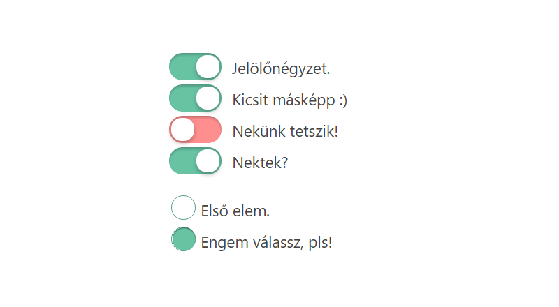

# Jelölőnégyzet és választógomb stílus



Modern és nagyszerű jelölőnégyzet és választógomb stílus a honlapodra! A kód segítségével a képen látható eredményt kaphatod a honlapon levő összes jelölőnégyzetre és választógombra.

...és még valami: Ez teljesen CSS3, nem kell semmilyen képet, szkriptet vagy akármit feltölteni!

Illeszd be az alábbi kódot a Stílusok táblázata (CSS) sablon végére: 

```css
input [type=checkbox]{vertical-align:top;margin:0 3px 0 0;width:17px;height:17px;}  
input[type=checkbox]:not(checked),input[type=radio]:not(checked){position:absolute;opacity:0;}  
input[type=checkbox]:not(checked) + label {position: relative; padding: 0 0 0 60px;}  
input[type=checkbox]:not(checked) + label:before{content:'';position:absolute;top:-4px;  
left:0;width:50px;height:26px;border-radius:13px;background:#FF8F8F;box-shadow:inset 0 2px 3px rgba(0,0,0,.2);}  
input[type=checkbox]:not(checked) + label:after {content:'';position: absolute;top:-2px;  
left:2px;width:22px;height:22px;border-radius:10px;background: #FFF;box-shadow: 0 2px 5px rgba(0,0,0,.3);transition:all 0.3s;}  
input[type=checkbox]:checked + label:before {background: #68C3A3;}  
input[type=checkbox]:checked + label:after {left: 26px;}  
input[type=radio]:not(checked) + label {position: relative;padding: 0px 0px 0px 30px;}  
input[type=radio]:not(checked) + label:before{content:'';position:absolute;top:-4px;left:2px;  
width:22px;height:22px;border:1px solid#55A086;border-radius:50%;background: #FFF;}  
input[type=radio]:not(checked) + label:after {content:'';position:absolute;top:-3px;  
left:3px;width:22px;height:22px;border-radius:50%;background:#68C3A3;  
box-shadow:inset 0 1px 1px rgba(0,0,0,.5);opacity:0;transition:all 0.3s;}  
input[type=radio]:checked + label:after {opacity:1;}  
label {line-height: 30px;}
```

*Forrás: http://ugarts.ru/load/decorations/menjaem_vid_chebox_i_radiobutton_dlja_sajta/5-1-0-71*
